Team5\_Regression\_Project\_PUBGData
================
junseung
2019년 1월 28일

<https://pubgtracker.com/profile/pc/baoli6666666?region=agg>

#### 약 85,000 명의 Top Ranked Players (<https://pubgtracker.com/>)

#### 한 시즌의 Player Data,

#### Game Type : Solo, Duo, Squad

### ***1. 데이터 분석을 위한 사전 작업***

#### **1-1. 필요한 패키지 불러오기**

``` r
library(readxl)
library(tidyverse)
library(lm.beta)
library(writexl)
library(gvlma)
library(car)
library(Metrics)
library(png)
library(RColorBrewer)
library(corrplot)
library(glmnet)
library(caret)
```

#### **1-3. 원본 데이터 불러오기**

``` r
PUBG <- read.csv(file = "PUBG_Player_Statistics.csv",
                 header = TRUE,
                 stringsAsFactors = TRUE)
```

### ***2. 데이터 확인하기***

#### **2-1. 전체 데이터 확인하기**

``` r
head(PUBG)
```

    ...
    ##     player_name tracker_id solo_KillDeathRatio solo_WinRatio
    ## 1     BreakNeck       4405                3.14         17.65
    ## 2     Blackwalk       8199                4.41         18.18
    ## 3 mercedes_benz       4454                3.60          0.00
    ## 4          DORA       7729               14.00         50.00
    ## 5       n2tstar          0               10.50         33.33
    ## 6    coldoxygen      33313                5.73         31.25
    ##   solo_TimeSurvived solo_RoundsPlayed solo_Wins solo_WinTop10Ratio
    ...

**총 데이터 행의 갯수**

``` r
nrow(PUBG)
```

    ## [1] 87898

**총 변수의 갯수**

``` r
ncol(PUBG)
```

    ## [1] 152

#### **2-2. 데이터 구조 확인하기**

``` r
str(PUBG)
```

    ...
    ## 'data.frame':    87898 obs. of  152 variables:
    ##  $ player_name              : Factor w/ 87896 levels "0-8-15-Wolf",..: 9360 7925 49105 19292 52623 13472 27179 41843 80220 24737 ...
    ##  $ tracker_id               : int  4405 8199 4454 7729 0 33313 15585 9454 24029 11289 ...
    ##  $ solo_KillDeathRatio      : num  3.14 4.41 3.6 14 10.5 5.73 2.45 2.71 3.68 4.17 ...
    ##  $ solo_WinRatio            : num  17.6 18.2 0 50 33.3 ...
    ##  $ solo_TimeSurvived        : num  18469 33015 4330 13422 9841 ...
    ##  $ solo_RoundsPlayed        : int  17 33 5 8 6 16 142 19 44 8 ...
    ##  $ solo_Wins                : int  3 6 0 4 2 5 12 5 6 2 ...
    ...

1.  data.frame 구조로 되어있다.

2.  player\_name 변수만 질적 자료인 factor, 나머지 변수는 모두 양적 자료인 numeric으로 이루어짐

3.  player\_name과 tracker\_id를 제외한 변수는 총 150개 여기서 솔로게임 관련 변수 50개, 듀오 게임 관련 변수 50개, 스쿼드 게임 관련 변수 50개 solo\_, duo\_, squad\_ 뒤에 붙는 변수명은 똑같이 겹친다

#### **2-3. 각 변수가 가지는 특징 및 입력오류 확인하기**

각 numeric 변수들의 최소값, 최대값, 평균, 중위수를 데이터 프레임으로 저장한다.

``` r
Variable <- c()
Min      <- c()
Median   <- c()
Mean     <- c()
Max      <- c()
options(scipen = 100)
for(i in 3:(ncol(PUBG))){
  PUBG.summary <- summary(PUBG[ , i])
  Variable <- c(Variable, colnames(PUBG[i]))
  Min      <- c(Min, PUBG.summary[1] %>% as.numeric() %>% round(digits = 1))
  Median   <- c(Median, PUBG.summary[3] %>% as.numeric() %>% round(digits = 1))
  Mean     <- c(Mean, PUBG.summary[4] %>% as.numeric() %>% round(digits = 1))
  Max      <- c(Max, PUBG.summary[6] %>% as.numeric() %>% round(digits = 1))
  PUBG.scale <- data.frame(Variable, Min, Median, Mean, Max)
}
PUBG.scale
```

    ...
    ##                      Variable    Min   Median     Mean       Max
    ## 1         solo_KillDeathRatio    0.0      1.5      1.9     100.0
    ## 2               solo_WinRatio    0.0      2.0      5.0     100.0
    ## 3           solo_TimeSurvived   76.1  45173.3  69715.7 1521200.1
    ## 4           solo_RoundsPlayed    1.0     48.0     79.3    1681.0
    ## 5                   solo_Wins    0.0      1.0      2.1     106.0
    ## 6          solo_WinTop10Ratio    0.0      0.1      0.2       1.0
    ## 7                 solo_Top10s    0.0      8.0     12.1     386.0
    ...

### ***3. 변수 가공(제거 및 나누기)***

#### **3-1. 값이 겹치는 변수, 모두 0으로 채워진 의미 없는 변수 제거하기**

총 12개의 변수를 제거한다

``` r
PUBG <- PUBG %>% dplyr::select(-c(tracker_id, solo_RevivesPg,
                                  solo_TeamKillsPg, solo_TeamKills,
                                  solo_WeaponAcquired, solo_MostSurvivalTime,
                                  solo_Revives, solo_DBNOs,
                                  duo_WeaponAcquired, duo_MostSurvivalTime,
                                  squad_WeaponAcquired, squad_MostSurvivalTime))
```

#### **3-2. 변수들끼리의 조합으로 새롭게 만들어진 변수를 제거하기**

총 46개의 변수를 제거한다

``` r
PUBG <- PUBG %>% dplyr::select(-c(solo_KillDeathRatio, solo_WinTop10Ratio,
                                  solo_Top10Ratio, solo_DamagePg,
                                  solo_HeadshotKillsPg, solo_HealsPg,
                                  solo_KillsPg, solo_MoveDistancePg,
                                  solo_RoadKillsPg, solo_TimeSurvivedPg,
                                  solo_Top10sPg, solo_HeadshotKillRatio,
                                  solo_DailyKills, solo_WeeklyKills,
                                  duo_KillDeathRatio, duo_WinTop10Ratio,
                                  duo_Top10Ratio, duo_DamagePg,
                                  duo_HeadshotKillsPg, duo_HealsPg,
                                  duo_KillsPg, duo_MoveDistancePg,
                                  duo_RevivesPg, duo_RoadKillsPg,
                                  duo_TeamKillsPg, duo_TimeSurvivedPg,
                                  duo_Top10sPg, duo_HeadshotKillRatio,
                                  duo_DailyKills, duo_WeeklyKills,
                                  squad_KillDeathRatio, squad_WinTop10Ratio,
                                  squad_Top10Ratio, squad_DamagePg,
                                  squad_HeadshotKillsPg, squad_HealsPg,
                                  squad_KillsPg, squad_MoveDistancePg,
                                  squad_RevivesPg, squad_RoadKillsPg,
                                  squad_TeamKillsPg, squad_TimeSurvivedPg,
                                  squad_Top10sPg, squad_HeadshotKillRatio,
                                  squad_DailyKills, squad_WeeklyKills))
```

**제거 된 후 총 변수의 갯수**

``` r
ncol(PUBG)
```

    ## [1] 94

#### **3-3. solo, duo, squad로 데이터 나누기**

``` r
PUBG.solo <- PUBG %>% 
  dplyr::select(contains("solo"))

PUBG.duo <- PUBG %>% 
  dplyr::select(contains("duo"))

PUBG.squad <- PUBG %>% 
  dplyr::select(contains("squad"))
```

**솔로 데이터 변수의 갯수**

``` r
ncol(PUBG.solo)
```

    ## [1] 29

**듀오 데이터 변수의 갯수**

``` r
ncol(PUBG.duo)
```

    ## [1] 32

**스쿼드 데이터 변수의 갯수**

``` r
ncol(PUBG.squad)
```

    ## [1] 32

### ***4. EDA***

#### **4-1. Histogram**

##### **4-1-1. solo에 대한 Histogram**

``` r
par(mfrow = c(2, 2))
for(i in 1:8){
  hist(PUBG.solo[ , i], 
       main = colnames(PUBG.solo)[i],
       xlim = c(min(PUBG.solo[ , i]), max(PUBG.solo[ , i])),
       xlab = colnames(PUBG.solo)[i],
       breaks = 100)
}
```

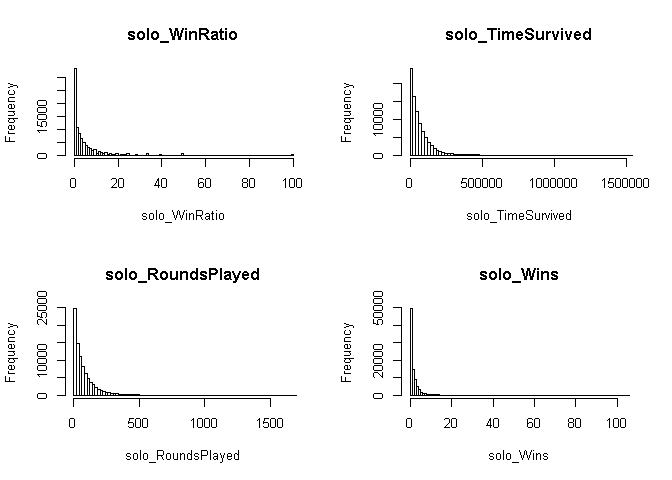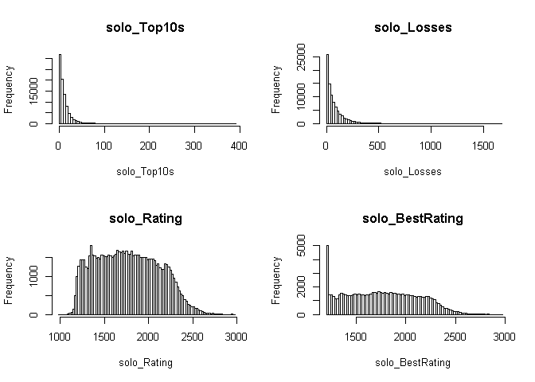

##### **4-1-2. duo에 대한 Histogram**

``` r
par(mfrow = c(2, 2))
for(i in 1:8){
  hist(PUBG.duo[ , i], 
       main = colnames(PUBG.duo)[i],
       xlim = c(min(PUBG.duo[ , i]), max(PUBG.duo[ , i])),
       xlab = colnames(PUBG.duo)[i],
       breaks = 100)
}
```

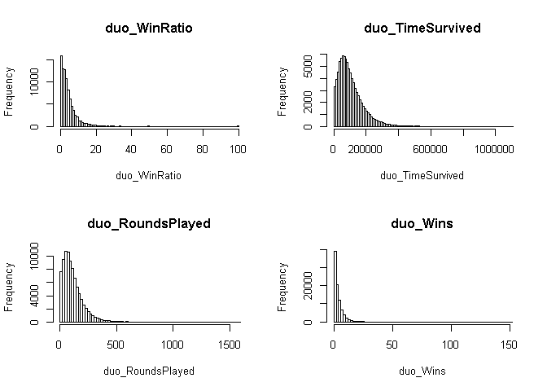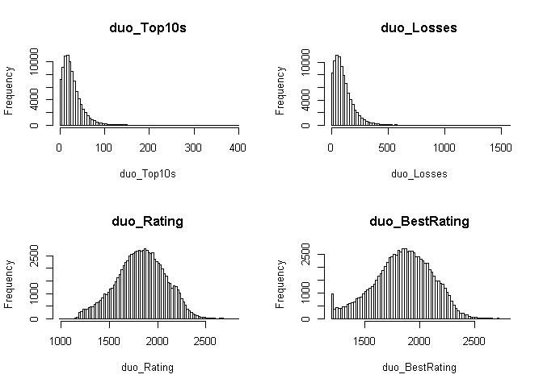

##### **4-1-3. squad에 대한 Histogram**

``` r
par(mfrow = c(2, 2))
for(i in 1:8){
  hist(PUBG.squad[ , i], 
       main = colnames(PUBG.squad)[i],
       xlim = c(min(PUBG.squad[ , i]), max(PUBG.squad[ , i])),
       xlab = colnames(PUBG.squad)[i],
       breaks = 100)
}
```

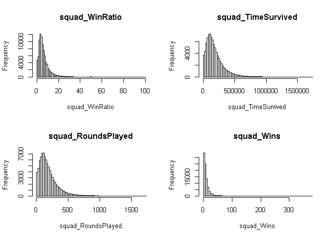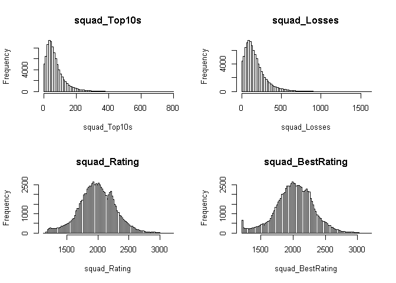

#### **4-2. Boxplot**

##### **4-2-1. solo에 대한 Boxplot**

``` r
par(mfrow = c(2, 2))
for(i in 1:8){
  boxplot(PUBG.solo[ , i], 
          main = colnames(PUBG.solo)[i])
}
```

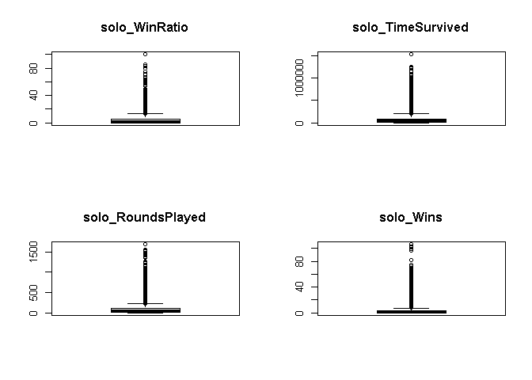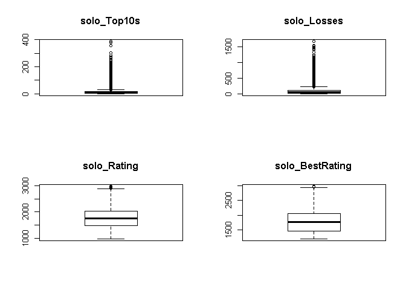

##### **4-2-2. duo에 대한 Boxplot**

``` r
par(mfrow = c(2, 2))
for(i in 1:8){
  boxplot(PUBG.duo[ , i], 
          main = colnames(PUBG.duo)[i])
}
```

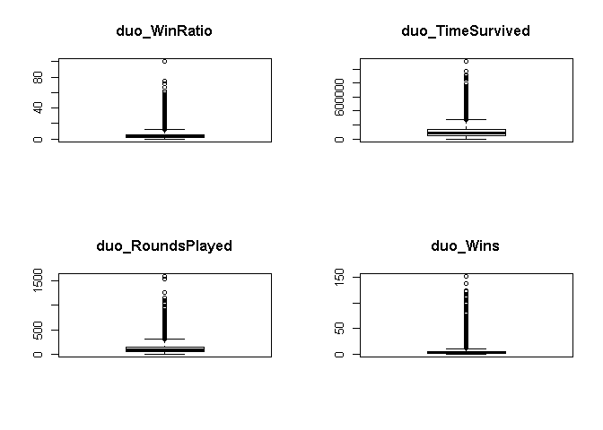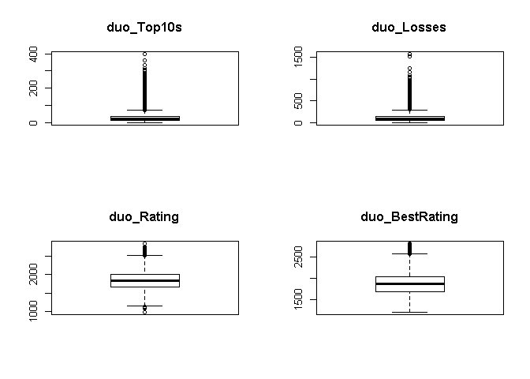

##### **4-2-3. squad에 대한 Boxplot**

``` r
par(mfrow = c(2, 2))
for(i in 1:8){
  boxplot(PUBG.squad[ , i], 
          main = colnames(PUBG.squad)[i])
}
```

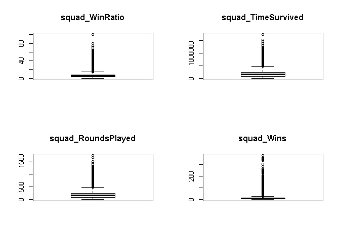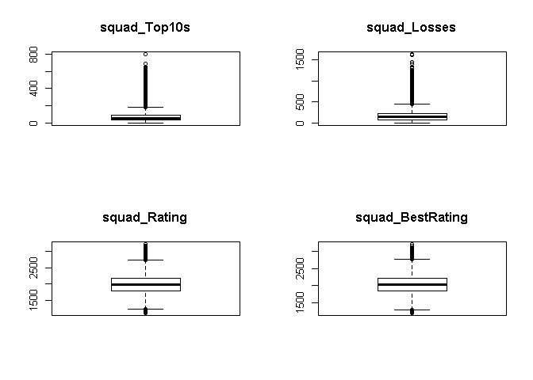

#### **4-3. 변수들 간의 상관관계 확인**

**솔로 변수들 간의 상관관계**

``` r
col1 <- colorRampPalette(c("white", "#9B1003"))

cor.solo <- cor(PUBG.solo)
corrplot(cor.solo,
         method = "color",
         number.cex = .7,
         col = col1(100),
         tl.col = "black",
         diag = FALSE,
         addCoef.col = "white",
         order = "AOE")
```

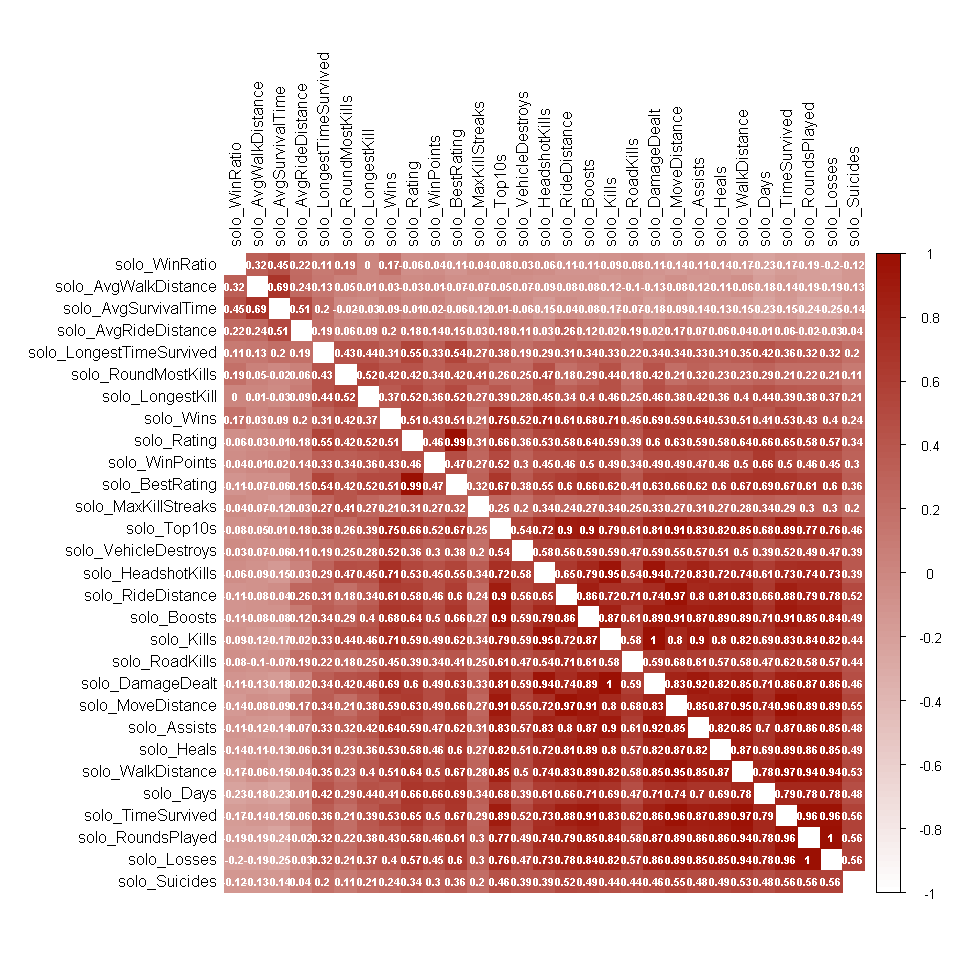

**듀오 변수들 간의 상관관계**

``` r
cor.duo <- cor(PUBG.duo)
corrplot(cor.duo,
         method = "color",
         number.cex = .7,
         col = col1(100),
         tl.col = "black",
         diag = FALSE,
         addCoef.col = "white",
         order = "AOE")
```

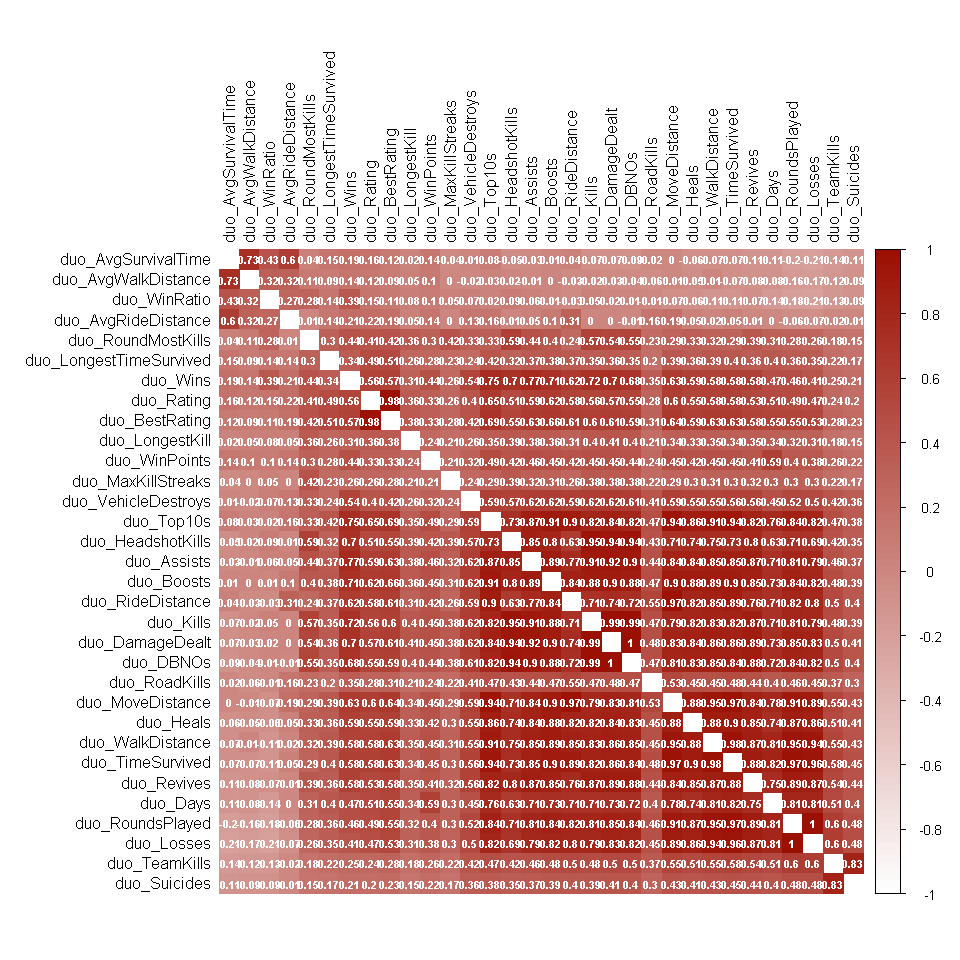

**스쿼드 변수들 간의 상관관계**

``` r
cor.squad <- cor(PUBG.squad)
corrplot(cor.squad,
         method = "color",
         number.cex = .7,
         col = col1(100),
         tl.col = "black",
         diag = FALSE,
         addCoef.col = "white",
         order = "AOE")
```


#### **4-4. 핵이라 판단되는 유저 데이터 다루기 **

##### **4-4-1. 첫번 째 도메인 지식**

게임에서 라운드 수 30판 이상인데 헤드샷 킬 비율이 40% 이상인 사람

프로게이머 수준의 랭커도 판수가 올라감에 따라 헤드샷 킬 비율이 30%를 넘기기 힘듬

핵을 쓰는 유저로 간주

**해당 핵 유저를 뽑아오기**

``` r
nuclear.player1 <- PUBG %>% 
  dplyr::filter(((solo_RoundsPlayed >= 30) & (round(solo_HeadshotKills / solo_Kills, digits = 2) >= 0.4)) | ((duo_RoundsPlayed >= 30) & (round(duo_HeadshotKills / duo_Kills, digits = 2) >= 0.4)) | ((squad_RoundsPlayed >= 30) & (round(squad_HeadshotKills / squad_Kills, digits = 2) >= 0.4)))
```

**첫번째 기준에 해당하는 핵 유저 수 **

``` r
nrow(nuclear.player1)
```

    ## [1] 585

**첫 번째 기준의 핵 유저 플레이어를 뺀 데이터 셋 만들기**

**%ni%를 함수는 포함되지 않는 함수를 정의한다**

``` r
'%ni%' <- Negate('%in%') 
nuclear.player1$player_name <- as.vector(nuclear.player1$player_name)
PUBG.pure <- PUBG[PUBG$player_name %ni% nuclear.player1$player_name, ]
```

**PUBG.pure 데이터의 행의 갯수**

``` r
nrow(PUBG.pure)
```

    ## [1] 87313

##### **4-4-2. 두번째 도메인 지식**

게임에서 라운드 수 5판 이상인데 킬/데스 비율이 20 이상인 사람

판수가 5판 이상인데도 비정상적으로 킬데스 비율이 높으면

핵 유저로 의심

**해당 핵 유저를 뽑아오기**

losses가 0인 값을 1로 변환해 주어야 한다.

그래야 분모가 0이 되는 것을 방지할 수 있다.

PUBG.pure 데이터에 임시로 이 변수를 저장해둔다.

``` r
PUBG.pure$solo_Losses.1 <- ifelse(PUBG.pure$solo_Losses == 0, 1, PUBG.pure$solo_Losses)
PUBG.pure$duo_Losses.1 <- ifelse(PUBG.pure$duo_Losses == 0, 1, PUBG.pure$duo_Losses)
PUBG.pure$squad_Losses.1 <- ifelse(PUBG.pure$squad_Losses == 0, 1, PUBG.pure$squad_Losses)
```

**해당 핵 유저를 뽑아오기**

``` r
nuclear.player2 <- PUBG.pure %>% 
 dplyr::filter(((solo_RoundsPlayed >= 5) & (solo_Kills/solo_Losses.1 >= 20)) | ((duo_RoundsPlayed >= 5) & (duo_Kills/duo_Losses.1 >= 20)) | ((squad_RoundsPlayed >= 5) & (squad_Kills/squad_Losses.1 >= 20)))
```

**두번째 기준에 해당하는 핵 유저 수 **

``` r
nrow(nuclear.player2)
```

    ## [1] 35

**두번때 기준의 핵 유저 플레이어를 뺀 데이터 셋 만들기**

``` r
nuclear.player2$player_name <- as.vector(nuclear.player2$player_name)
PUBG.pure <- PUBG.pure[PUBG.pure$player_name %ni% nuclear.player2$player_name, ]
```

**PUBG.pure 데이터의 행의 갯수**

``` r
nrow(PUBG.pure)
```

    ## [1] 87278

**임시로 저장했던 변수들을 다시 제거**

``` r
PUBG.pure <- PUBG.pure %>% 
  dplyr::select(-c(solo_Losses.1, duo_Losses.1, squad_Losses.1))
```

##### **4-4-3. 정제한 데이터를 가지고 솔로, 듀오, 스쿼드 나누기**

``` r
PUBG.solo.pure <- PUBG.pure %>% dplyr::select(contains("solo"))
PUBG.duo.pure <- PUBG.pure %>% dplyr::select(contains("duo"))
PUBG.squad.pure <- PUBG.pure %>% dplyr::select(contains("squad"))
```

#### **4-5. 승률이 0인 유저 제외 **

승률이 0인 사람들은 자신의 승률을 궁금해 하지 않는다

따라서 치킨을 한번이라도 먹어본 사람들의 승률을 예측하기로 함

``` r
PUBG.solo.data <- PUBG.solo.pure %>% dplyr::filter(solo_WinRatio > 0) 
PUBG.duo.data <- PUBG.duo.pure %>% dplyr::filter(duo_WinRatio > 0) 
PUBG.squad.data <- PUBG.squad.pure %>% dplyr::filter(squad_WinRatio > 0) 
```

**최종 데이터 갯수 확인하기**

``` r
nrow(PUBG.solo.data)
```

    ## [1] 60669

``` r
nrow(PUBG.duo.data)
```

    ## [1] 76183

``` r
nrow(PUBG.squad.data)
```

    ## [1] 83735

### ***5. 분석을 위한 데이터셋 만들기***

#### ***5-1. train set, test set 나누기***

**solo**

``` r
set.seed(seed = 123)

index <- sample(1:2,
                size = nrow(PUBG.solo.data),
                replace = TRUE,
                prob = c(0.7, 0.3))
solo.trainSet <- PUBG.solo.data[index == 1, ]
solo.testSet <- PUBG.solo.data[index == 2, ]
```

**duo**

``` r
set.seed(seed = 1234)

index <- sample(1:2,
                size = nrow(PUBG.duo.data),
                replace = TRUE,
                prob = c(0.7, 0.3))
duo.trainSet <- PUBG.duo.data[index == 1, ]
duo.testSet <- PUBG.duo.data[index == 2, ]
```

**squad**

``` r
set.seed(seed = 12345)

index <- sample(1:2,
                size = nrow(PUBG.squad.data),
                replace = TRUE,
                prob = c(0.7, 0.3))
squad.trainSet <- PUBG.squad.data[index == 1, ]
squad.testSet <- PUBG.squad.data[index == 2, ]
```

### ***6. 회귀분석***

#### ***6-1. 솔로 게임 회귀분석***

##### \***6-1-1. 모든 변수를 다 넣고 회귀분석**

``` r
fit.solo.all <- lm(solo_WinRatio ~., 
                   data = solo.trainSet)

summary(fit.solo.all)
```

    ## 
    ## Call:
    ## lm(formula = solo_WinRatio ~ ., data = solo.trainSet)
    ## 
    ## Residuals:
    ##     Min      1Q  Median      3Q     Max 
    ## -44.736  -3.849  -0.593   2.535  70.191 
    ## 
    ## Coefficients: (1 not defined because of singularities)
    ##                              Estimate   Std. Error t value
    ## (Intercept)               6.047240593  0.865338047   6.988
    ## solo_TimeSurvived        -0.000077610  0.000004672 -16.610
    ## solo_RoundsPlayed         0.088445350  0.002611901  33.862
    ## solo_Wins                 1.218042786  0.021962935  55.459
    ## solo_Top10s              -0.097204262  0.010251920  -9.482
    ## solo_Losses                        NA           NA      NA
    ## solo_Rating               0.033363785  0.000762953  43.730
    ## solo_BestRating          -0.042059415  0.000757016 -55.560
    ## solo_Kills               -0.043868870  0.004760326  -9.216
    ## solo_Assists             -0.021183445  0.011873535  -1.784
    ## solo_Suicides             0.081570677  0.039796131   2.050
    ## solo_HeadshotKills       -0.003456909  0.004276119  -0.808
    ## solo_VehicleDestroys     -0.042822805  0.023559948  -1.818
    ## solo_RoadKills            0.006751656  0.017187036   0.393
    ## solo_RoundMostKills       0.524408815  0.016756175  31.296
    ## solo_MaxKillStreaks      -0.193280602  0.038496607  -5.021
    ## solo_Days                -0.086911754  0.005331461 -16.302
    ## solo_LongestTimeSurvived -0.002760722  0.000438014  -6.303
    ## solo_AvgSurvivalTime      0.022124488  0.000262569  84.262
    ## solo_WinPoints           -0.000645858  0.000038872 -16.615
    ## solo_WalkDistance        -0.145373149  0.664725429  -0.219
    ## solo_RideDistance        -0.145365844  0.664725435  -0.219
    ## solo_MoveDistance         0.145369125  0.664725416   0.219
    ## solo_AvgWalkDistance      0.000087107  0.000086901   1.002
    ## solo_AvgRideDistance     -0.000453221  0.000054103  -8.377
    ## solo_LongestKill         -0.004238941  0.000386078 -10.979
    ## solo_Heals                0.001103349  0.000517508   2.132
    ## solo_Boosts               0.004272946  0.000867379   4.926
    ## solo_DamageDealt          0.000220504  0.000043923   5.020
    ##                                      Pr(>|t|)    
    ## (Intercept)                  0.00000000000282 ***
    ## solo_TimeSurvived        < 0.0000000000000002 ***
    ## solo_RoundsPlayed        < 0.0000000000000002 ***
    ## solo_Wins                < 0.0000000000000002 ***
    ## solo_Top10s              < 0.0000000000000002 ***
    ## solo_Losses                                NA    
    ## solo_Rating              < 0.0000000000000002 ***
    ## solo_BestRating          < 0.0000000000000002 ***
    ## solo_Kills               < 0.0000000000000002 ***
    ## solo_Assists                           0.0744 .  
    ## solo_Suicides                          0.0404 *  
    ## solo_HeadshotKills                     0.4189    
    ## solo_VehicleDestroys                   0.0691 .  
    ## solo_RoadKills                         0.6944    
    ## solo_RoundMostKills      < 0.0000000000000002 ***
    ## solo_MaxKillStreaks          0.00000051686232 ***
    ## solo_Days                < 0.0000000000000002 ***
    ## solo_LongestTimeSurvived     0.00000000029515 ***
    ## solo_AvgSurvivalTime     < 0.0000000000000002 ***
    ## solo_WinPoints           < 0.0000000000000002 ***
    ## solo_WalkDistance                      0.8269    
    ## solo_RideDistance                      0.8269    
    ## solo_MoveDistance                      0.8269    
    ## solo_AvgWalkDistance                   0.3162    
    ## solo_AvgRideDistance     < 0.0000000000000002 ***
    ## solo_LongestKill         < 0.0000000000000002 ***
    ## solo_Heals                             0.0330 *  
    ## solo_Boosts                  0.00000084127565 ***
    ## solo_DamageDealt             0.00000051803788 ***
    ## ---
    ## Signif. codes:  0 '***' 0.001 '**' 0.01 '*' 0.05 '.' 0.1 ' ' 1
    ## 
    ## Residual standard error: 7.8 on 42556 degrees of freedom
    ## Multiple R-squared:  0.5255, Adjusted R-squared:  0.5252 
    ## F-statistic:  1745 on 27 and 42556 DF,  p-value: < 0.00000000000000022

**승률을 -로 예측하는 것을 0으로 바꿔 예측**

``` r
pred.solo.all <- ifelse(predict(fit.solo.all, solo.testSet) < 0, 
                        0,
                        predict(fit.solo.all, solo.testSet))
```

    ## Warning in predict.lm(fit.solo.all, solo.testSet): prediction from a rank-
    ## deficient fit may be misleading

    ## Warning in predict.lm(fit.solo.all, solo.testSet): prediction from a rank-
    ## deficient fit may be misleading

**rmse값 구하기**

``` r
rmse(solo.testSet$solo_WinRatio,
     pred.solo.all)
```

    ## [1] 7.523371

##### \***6-1-2. stepwise, 다중공선성 제거 후 회귀분석**

\*\*stepwise를 both로 설정하고, 유의하지 않은 변수를 제거하고, 다중공선성이 10이 넘는 변수를 자동으로 제거하는 함수를 만듬

``` r
new.model.func <- function(dataset,
                           target.variable){
  
  result <- lm(dataset[,target.variable] ~.,
               data = dataset %>%
                 dplyr::select(-contains(target.variable)))
  
  return(result)
  
}

Normal.regression <- function(dataset,
                              target.variable,
                              stepwise.option = FALSE){
  
  new.model <- new.model.func(dataset, target.variable)
  
  if(stepwise.option == TRUE){
    
    normal.step <- step(new.model,
                        direction = "both")
    
    newdataset <- dataset %>% dplyr::select(contains(target.variable),
                                            names(normal.step$coefficients[-1]))

    new.model <- new.model.func(newdataset, target.variable)
    
  }else{
    
    normal <- summary(new.model)
    
    newdataset <- dataset %>% dplyr::select(contains(target.variable),
                                            rownames(normal$coefficients[normal$coefficients[, 4] <= 0.05, ])[-1])

    new.model <- new.model.func(newdataset, target.variable)
    
  }
  
  newdataset <- newdataset %>% dplyr::select(contains(target.variable),
                                             names(vif(new.model)[vif(new.model)<10]))
  
  new.model <- new.model.func(newdataset, target.variable)
  
  normal <- summary(new.model)
  
  newdataset <- dataset %>% dplyr::select(contains(target.variable),
                                          rownames(normal$coefficients[normal$coefficients[, 4] <= 0.05, ])[-1])
  
  new.model <- new.model.func(newdataset, target.variable)
  
  return(new.model)
  
}
```

``` r
summary(fit.solo.step)
```

    ## 
    ## Call:
    ## lm(formula = dataset[, target.variable] ~ ., data = dataset %>% 
    ##     dplyr::select(-contains(target.variable)))
    ## 
    ## Residuals:
    ##     Min      1Q  Median      3Q     Max 
    ## -29.702  -4.309  -1.063   2.505  79.916 
    ## 
    ## Coefficients:
    ##                             Estimate  Std. Error t value
    ## (Intercept)               8.68776170  0.93270532   9.315
    ## solo_Wins                 0.41653654  0.01464452  28.443
    ## solo_Suicides             0.20322617  0.04119375   4.933
    ## solo_RoundMostKills       0.51996007  0.01702736  30.537
    ## solo_MaxKillStreaks      -0.23824361  0.04181707  -5.697
    ## solo_Days                -0.18525282  0.00510525 -36.287
    ## solo_LongestTimeSurvived -0.01017067  0.00046390 -21.924
    ## solo_AvgSurvivalTime      0.02246317  0.00021140 106.258
    ## solo_WinPoints           -0.00043065  0.00004180 -10.302
    ## solo_AvgRideDistance     -0.00078260  0.00005158 -15.173
    ## solo_LongestKill         -0.00863170  0.00041466 -20.816
    ## solo_Heals               -0.00106415  0.00036825  -2.890
    ##                                      Pr(>|t|)    
    ## (Intercept)              < 0.0000000000000002 ***
    ## solo_Wins                < 0.0000000000000002 ***
    ## solo_Suicides                    0.0000008111 ***
    ## solo_RoundMostKills      < 0.0000000000000002 ***
    ## solo_MaxKillStreaks              0.0000000123 ***
    ## solo_Days                < 0.0000000000000002 ***
    ## solo_LongestTimeSurvived < 0.0000000000000002 ***
    ## solo_AvgSurvivalTime     < 0.0000000000000002 ***
    ## solo_WinPoints           < 0.0000000000000002 ***
    ## solo_AvgRideDistance     < 0.0000000000000002 ***
    ## solo_LongestKill         < 0.0000000000000002 ***
    ## solo_Heals                            0.00386 ** 
    ## ---
    ## Signif. codes:  0 '***' 0.001 '**' 0.01 '*' 0.05 '.' 0.1 ' ' 1
    ## 
    ## Residual standard error: 8.583 on 42572 degrees of freedom
    ## Multiple R-squared:  0.4251, Adjusted R-squared:  0.425 
    ## F-statistic:  2862 on 11 and 42572 DF,  p-value: < 0.00000000000000022

**승률을 -로 예측하는 것을 0으로 바꿔 예측**

``` r
pred.solo.step <- ifelse(predict(fit.solo.step, solo.testSet) < 0, 
                        0,
                        predict(fit.solo.step, solo.testSet))
```

**rmse값 구하기**

``` r
rmse(solo.testSet$solo_WinRatio,
     pred.solo.step)
```

    ## [1] 8.347584

##### \***6-1-3. Ridge, Lasso grid search **

**RMSE를 최소로 하는 ALPHA(람다) 값을 출력하는 함수를 만듬**

``` r
x <- model.matrix(solo_WinRatio ~ ., solo.trainSet)[, -1]
y <- solo.trainSet$solo_WinRatio
z <- model.matrix(solo_WinRatio ~ ., solo.testSet)[, -1]

a <- c(seq(0,1,0.1))
rmse <- c()
alpha <- c()

for(i in a){
  ridge.lasso.solo <- cv.glmnet(x, y, alpha = i)
  lasso.coef <- predict(ridge.lasso.solo, type = "coefficients", s = ridge.lasso.solo$lambda.min)
  pred.solo.ridge.lasso <- ifelse(predict(ridge.lasso.solo, s = ridge.lasso.solo$lambda.min, newx = z) < 0, 0, predict(ridge.lasso.solo, s = ridge.lasso.solo$lambda.min, newx = z))
  rmse <- c(rmse, RMSE(solo.testSet$solo_WinRatio, pred.solo.ridge.lasso))
  alpha <- c(alpha, i)
  grid.solo <- data.frame(RMSE = rmse,
                     ALPHA = alpha)
}
```

**RMSE와 ALPHA를 표로 출력**

``` r
grid.solo
```

    ##        RMSE ALPHA
    ## 1  7.865769   0.0
    ## 2  7.537589   0.1
    ## 3  7.529262   0.2
    ## 4  7.530944   0.3
    ## 5  7.530518   0.4
    ## 6  7.528854   0.5
    ## 7  7.527972   0.6
    ## 8  7.528530   0.7
    ## 9  7.529030   0.8
    ## 10 7.528615   0.9
    ## 11 7.527174   1.0

#### ***6-2. 듀오 게임 회귀분석***

##### \***6-2-1. 모든 변수를 다 넣고 회귀분석**

``` r
fit.duo.all <- lm(duo_WinRatio ~., 
                  data = duo.trainSet)

summary(fit.duo.all)
```

    ## 
    ## Call:
    ## lm(formula = duo_WinRatio ~ ., data = duo.trainSet)
    ## 
    ## Residuals:
    ##     Min      1Q  Median      3Q     Max 
    ## -36.732  -1.758  -0.370   1.069  83.589 
    ## 
    ## Coefficients: (1 not defined because of singularities)
    ##                             Estimate   Std. Error t value
    ## (Intercept)             -0.956115849  0.424058515  -2.255
    ## duo_TimeSurvived        -0.000056696  0.000002753 -20.597
    ## duo_RoundsPlayed         0.046951039  0.001438500  32.639
    ## duo_Wins                 0.811256765  0.007157727 113.340
    ## duo_Top10s              -0.037262691  0.004194783  -8.883
    ## duo_Losses                        NA           NA      NA
    ## duo_Rating               0.009291949  0.000331587  28.023
    ## duo_BestRating          -0.011693451  0.000335176 -34.887
    ## duo_Kills               -0.018338241  0.001480338 -12.388
    ## duo_Assists             -0.020594584  0.001845811 -11.157
    ## duo_Suicides             0.004717774  0.021553557   0.219
    ## duo_TeamKills           -0.008007510  0.013833428  -0.579
    ## duo_HeadshotKills       -0.000457200  0.002238452  -0.204
    ## duo_VehicleDestroys      0.036152805  0.010584267   3.416
    ## duo_RoadKills           -0.003986700  0.014479316  -0.275
    ## duo_RoundMostKills       0.297749106  0.008025139  37.102
    ## duo_MaxKillStreaks      -0.103253150  0.020643376  -5.002
    ## duo_Days                -0.089801018  0.002713180 -33.098
    ## duo_LongestTimeSurvived  0.000025913  0.000202083   0.128
    ## duo_AvgSurvivalTime      0.010986207  0.000178303  61.615
    ## duo_WinPoints           -0.000026344  0.000017089  -1.542
    ## duo_WalkDistance        -0.335226537  0.277323524  -1.209
    ## duo_RideDistance        -0.335228347  0.277323529  -1.209
    ## duo_MoveDistance         0.335227468  0.277323528   1.209
    ## duo_AvgWalkDistance     -0.000283024  0.000065978  -4.290
    ## duo_AvgRideDistance      0.000013755  0.000034215   0.402
    ## duo_LongestKill         -0.000126404  0.000109649  -1.153
    ## duo_Heals                0.000836581  0.000234259   3.571
    ## duo_Revives              0.001004257  0.002928843   0.343
    ## duo_Boosts               0.001050935  0.000422858   2.485
    ## duo_DamageDealt          0.000077934  0.000013910   5.603
    ## duo_DBNOs               -0.000044601  0.002492494  -0.018
    ##                                     Pr(>|t|)    
    ## (Intercept)                         0.024158 *  
    ## duo_TimeSurvived        < 0.0000000000000002 ***
    ## duo_RoundsPlayed        < 0.0000000000000002 ***
    ## duo_Wins                < 0.0000000000000002 ***
    ## duo_Top10s              < 0.0000000000000002 ***
    ## duo_Losses                                NA    
    ## duo_Rating              < 0.0000000000000002 ***
    ## duo_BestRating          < 0.0000000000000002 ***
    ## duo_Kills               < 0.0000000000000002 ***
    ## duo_Assists             < 0.0000000000000002 ***
    ## duo_Suicides                        0.826740    
    ## duo_TeamKills                       0.562691    
    ## duo_HeadshotKills                   0.838160    
    ## duo_VehicleDestroys                 0.000637 ***
    ## duo_RoadKills                       0.783058    
    ## duo_RoundMostKills      < 0.0000000000000002 ***
    ## duo_MaxKillStreaks              0.0000005699 ***
    ## duo_Days                < 0.0000000000000002 ***
    ## duo_LongestTimeSurvived             0.897967    
    ## duo_AvgSurvivalTime     < 0.0000000000000002 ***
    ## duo_WinPoints                       0.123176    
    ## duo_WalkDistance                    0.226748    
    ## duo_RideDistance                    0.226746    
    ## duo_MoveDistance                    0.226747    
    ## duo_AvgWalkDistance             0.0000179228 ***
    ## duo_AvgRideDistance                 0.687682    
    ## duo_LongestKill                     0.248998    
    ## duo_Heals                           0.000356 ***
    ## duo_Revives                         0.731686    
    ## duo_Boosts                          0.012947 *  
    ## duo_DamageDealt                 0.0000000212 ***
    ## duo_DBNOs                           0.985723    
    ## ---
    ## Signif. codes:  0 '***' 0.001 '**' 0.01 '*' 0.05 '.' 0.1 ' ' 1
    ## 
    ## Residual standard error: 3.957 on 53189 degrees of freedom
    ## Multiple R-squared:  0.5107, Adjusted R-squared:  0.5104 
    ## F-statistic:  1850 on 30 and 53189 DF,  p-value: < 0.00000000000000022

**승률을 -로 예측하는 것을 0으로 바꿔 예측**

``` r
pred.duo.all <- ifelse(predict(fit.duo.all, duo.testSet) < 0, 
                       0,
                       predict(fit.duo.all, duo.testSet))
```

    ## Warning in predict.lm(fit.duo.all, duo.testSet): prediction from a rank-
    ## deficient fit may be misleading

    ## Warning in predict.lm(fit.duo.all, duo.testSet): prediction from a rank-
    ## deficient fit may be misleading

**rmse값 구하기**

``` r
rmse(duo.testSet$duo_WinRatio,
     pred.duo.all)
```

    ## [1] 3.913494

##### \***6-2-2. stepwise, 다중공선성 제거 후 회귀분석**

``` r
summary(fit.duo.step)
```

    ## 
    ## Call:
    ## lm(formula = dataset[, target.variable] ~ ., data = dataset %>% 
    ##     dplyr::select(-contains(target.variable)))
    ## 
    ## Residuals:
    ##     Min      1Q  Median      3Q     Max 
    ## -34.986  -1.834  -0.499   0.996  87.006 
    ## 
    ## Coefficients:
    ##                          Estimate    Std. Error t value
    ## (Intercept)         -2.8599876162  0.1251511860 -22.852
    ## duo_Wins             0.6304025443  0.0057218331 110.175
    ## duo_Assists         -0.0222499227  0.0015128209 -14.708
    ## duo_VehicleDestroys  0.0483129774  0.0106006302   4.558
    ## duo_RoundMostKills   0.2358691968  0.0071951415  32.782
    ## duo_MaxKillStreaks  -0.1213293899  0.0212959948  -5.697
    ## duo_Days            -0.1143126874  0.0025430546 -44.951
    ## duo_AvgSurvivalTime  0.0091411432  0.0001382219  66.134
    ## duo_WinPoints        0.0000686144  0.0000173751   3.949
    ## duo_RideDistance    -0.0000051134  0.0000002268 -22.544
    ## duo_AvgWalkDistance -0.0002864638  0.0000577462  -4.961
    ## duo_Heals            0.0005574124  0.0002304611   2.419
    ## duo_Boosts          -0.0073109194  0.0003892604 -18.782
    ##                                 Pr(>|t|)    
    ## (Intercept)         < 0.0000000000000002 ***
    ## duo_Wins            < 0.0000000000000002 ***
    ## duo_Assists         < 0.0000000000000002 ***
    ## duo_VehicleDestroys         0.0000051867 ***
    ## duo_RoundMostKills  < 0.0000000000000002 ***
    ## duo_MaxKillStreaks          0.0000000122 ***
    ## duo_Days            < 0.0000000000000002 ***
    ## duo_AvgSurvivalTime < 0.0000000000000002 ***
    ## duo_WinPoints               0.0000785791 ***
    ## duo_RideDistance    < 0.0000000000000002 ***
    ## duo_AvgWalkDistance         0.0000007044 ***
    ## duo_Heals                         0.0156 *  
    ## duo_Boosts          < 0.0000000000000002 ***
    ## ---
    ## Signif. codes:  0 '***' 0.001 '**' 0.01 '*' 0.05 '.' 0.1 ' ' 1
    ## 
    ## Residual standard error: 4.12 on 53207 degrees of freedom
    ## Multiple R-squared:  0.4693, Adjusted R-squared:  0.4691 
    ## F-statistic:  3920 on 12 and 53207 DF,  p-value: < 0.00000000000000022

**승률을 -로 예측하는 것을 0으로 바꿔 예측**

``` r
pred.duo.step <- ifelse(predict(fit.duo.step, duo.testSet) < 0, 
                        0,
                        predict(fit.duo.step, duo.testSet))
```

**rmse값 구하기**

``` r
rmse(duo.testSet$duo_WinRatio,
     pred.duo.step)
```

    ## [1] 4.073895

##### \***6-2-3. Ridge, Lasso grid search **

**RMSE를 최소로 하는 ALPHA(람다) 값을 출력하는 함수를 만듬**

``` r
x <- model.matrix(duo_WinRatio ~ ., duo.trainSet)[, -1]
y <- duo.trainSet$duo_WinRatio
z <- model.matrix(duo_WinRatio ~ ., duo.testSet)[, -1]

a <- c(seq(0,1,0.1))
rmse <- c()
alpha <- c()

for(i in a){
  ridge.lasso.duo <- cv.glmnet(x, y, alpha = i)
  lasso.coef <- predict(ridge.lasso.duo, type = "coefficients", s = ridge.lasso.duo$lambda.min)
  pred.duo.ridge.lasso <- ifelse(predict(ridge.lasso.duo, s = ridge.lasso.duo$lambda.min, newx = z) < 0, 0, predict(ridge.lasso.duo, s = ridge.lasso.duo$lambda.min, newx = z))
  rmse <- c(rmse, RMSE(duo.testSet$duo_WinRatio, pred.duo.ridge.lasso))
  alpha <- c(alpha, i)
  grid.duo <- data.frame(RMSE = rmse,
                         ALPHA = alpha)
}
```

**RMSE와 ALPHA를 표로 출력**

``` r
grid.duo
```

    ##        RMSE ALPHA
    ## 1  3.998207   0.0
    ## 2  3.916148   0.1
    ## 3  3.915970   0.2
    ## 4  3.916319   0.3
    ## 5  3.915914   0.4
    ## 6  3.917117   0.5
    ## 7  3.915353   0.6
    ## 8  3.917106   0.7
    ## 9  3.917415   0.8
    ## 10 3.917995   0.9
    ## 11 3.917783   1.0

#### ***6-3. 스쿼드 게임 회귀분석***

##### \***6-3-1. 모든 변수를 다 넣고 회귀분석**

``` r
fit.squad.all <- lm(squad_WinRatio ~., 
                    data = squad.trainSet)

summary(fit.squad.all)
```

    ## 
    ## Call:
    ## lm(formula = squad_WinRatio ~ ., data = squad.trainSet)
    ## 
    ## Residuals:
    ##     Min      1Q  Median      3Q     Max 
    ## -66.271  -1.670  -0.360   1.027  86.866 
    ## 
    ## Coefficients: (1 not defined because of singularities)
    ##                               Estimate   Std. Error t value
    ## (Intercept)               -2.651671419  0.351970903  -7.534
    ## squad_TimeSurvived        -0.000020880  0.000001701 -12.277
    ## squad_RoundsPlayed         0.016957037  0.000868452  19.526
    ## squad_Wins                 0.424851650  0.003110067 136.605
    ## squad_Top10s              -0.022176198  0.002052817 -10.803
    ## squad_Losses                        NA           NA      NA
    ## squad_Rating               0.005933716  0.000260072  22.816
    ## squad_BestRating          -0.006035545  0.000266602 -22.639
    ## squad_Kills               -0.007863219  0.000820920  -9.579
    ## squad_Assists             -0.012241225  0.001042504 -11.742
    ## squad_Suicides             0.030986729  0.012188612   2.542
    ## squad_TeamKills           -0.002182129  0.004289524  -0.509
    ## squad_HeadshotKills        0.002836113  0.001441200   1.968
    ## squad_VehicleDestroys     -0.006401203  0.005365071  -1.193
    ## squad_RoadKills           -0.002022491  0.009952040  -0.203
    ## squad_RoundMostKills       0.272912556  0.006752746  40.415
    ## squad_MaxKillStreaks      -0.188502263  0.014093559 -13.375
    ## squad_Days                -0.073744431  0.001905486 -38.701
    ## squad_LongestTimeSurvived  0.000514984  0.000170042   3.029
    ## squad_AvgSurvivalTime      0.007112974  0.000159009  44.733
    ## squad_WinPoints            0.000261587  0.000013489  19.393
    ## squad_WalkDistance        -0.510532445  0.121450754  -4.204
    ## squad_RideDistance        -0.510534355  0.121450759  -4.204
    ## squad_MoveDistance         0.510532360  0.121450758   4.204
    ## squad_AvgWalkDistance      0.000086712  0.000054827   1.582
    ## squad_AvgRideDistance      0.000309123  0.000029385  10.520
    ## squad_LongestKill          0.000147087  0.000090025   1.634
    ## squad_Heals               -0.000139775  0.000134352  -1.040
    ## squad_Revives              0.002790219  0.001260264   2.214
    ## squad_Boosts               0.001813574  0.000236486   7.669
    ## squad_DamageDealt          0.000027216  0.000008009   3.398
    ## squad_DBNOs               -0.001402301  0.001247433  -1.124
    ##                                       Pr(>|t|)    
    ## (Intercept)                 0.0000000000000500 ***
    ## squad_TimeSurvived        < 0.0000000000000002 ***
    ## squad_RoundsPlayed        < 0.0000000000000002 ***
    ## squad_Wins                < 0.0000000000000002 ***
    ## squad_Top10s              < 0.0000000000000002 ***
    ## squad_Losses                                NA    
    ## squad_Rating              < 0.0000000000000002 ***
    ## squad_BestRating          < 0.0000000000000002 ***
    ## squad_Kills               < 0.0000000000000002 ***
    ## squad_Assists             < 0.0000000000000002 ***
    ## squad_Suicides                        0.011016 *  
    ## squad_TeamKills                       0.610957    
    ## squad_HeadshotKills                   0.049086 *  
    ## squad_VehicleDestroys                 0.232825    
    ## squad_RoadKills                       0.838961    
    ## squad_RoundMostKills      < 0.0000000000000002 ***
    ## squad_MaxKillStreaks      < 0.0000000000000002 ***
    ## squad_Days                < 0.0000000000000002 ***
    ## squad_LongestTimeSurvived             0.002458 ** 
    ## squad_AvgSurvivalTime     < 0.0000000000000002 ***
    ## squad_WinPoints           < 0.0000000000000002 ***
    ## squad_WalkDistance          0.0000263071988823 ***
    ## squad_RideDistance          0.0000263053907591 ***
    ## squad_MoveDistance          0.0000263072942583 ***
    ## squad_AvgWalkDistance                 0.113755    
    ## squad_AvgRideDistance     < 0.0000000000000002 ***
    ## squad_LongestKill                     0.102297    
    ## squad_Heals                           0.298177    
    ## squad_Revives                         0.026833 *  
    ## squad_Boosts                0.0000000000000176 ***
    ## squad_DamageDealt                     0.000679 ***
    ## squad_DBNOs                           0.260954    
    ## ---
    ## Signif. codes:  0 '***' 0.001 '**' 0.01 '*' 0.05 '.' 0.1 ' ' 1
    ## 
    ## Residual standard error: 3.539 on 58653 degrees of freedom
    ## Multiple R-squared:  0.5689, Adjusted R-squared:  0.5687 
    ## F-statistic:  2580 on 30 and 58653 DF,  p-value: < 0.00000000000000022

**승률을 -로 예측하는 것을 0으로 바꿔 예측**

``` r
pred.squad.all <- ifelse(predict(fit.squad.all, squad.testSet) < 0, 
                         0,
                         predict(fit.squad.all, squad.testSet))
```

    ## Warning in predict.lm(fit.squad.all, squad.testSet): prediction from a
    ## rank-deficient fit may be misleading

    ## Warning in predict.lm(fit.squad.all, squad.testSet): prediction from a
    ## rank-deficient fit may be misleading

**rmse값 구하기**

``` r
rmse(squad.testSet$squad_WinRatio,
     pred.squad.all)
```

    ## [1] 3.594762

##### \***6-3-2. stepwise, 다중공선성 제거 후 회귀분석**

``` r
summary(fit.squad.step)
```

    ## 
    ## Call:
    ## lm(formula = dataset[, target.variable] ~ ., data = dataset %>% 
    ##     dplyr::select(-contains(target.variable)))
    ## 
    ## Residuals:
    ##     Min      1Q  Median      3Q     Max 
    ## -15.142  -2.472  -0.555   1.564  87.683 
    ## 
    ## Coefficients:
    ##                              Estimate  Std. Error t value
    ## (Intercept)               -9.79868278  0.42278048 -23.177
    ## squad_Suicides            -0.22206698  0.01128703 -19.675
    ## squad_RoundMostKills       0.43067532  0.00710635  60.604
    ## squad_MaxKillStreaks      -0.41447013  0.01772408 -23.385
    ## squad_Days                -0.11340947  0.00218558 -51.890
    ## squad_LongestTimeSurvived  0.00216555  0.00021181  10.224
    ## squad_AvgSurvivalTime      0.00880237  0.00017994  48.918
    ## squad_WinPoints            0.00072765  0.00001670  43.584
    ## squad_AvgWalkDistance      0.00009490  0.00006266   1.515
    ## squad_AvgRideDistance      0.00057016  0.00003067  18.588
    ## squad_LongestKill          0.00066760  0.00011316   5.899
    ## squad_Revives              0.01059315  0.00088164  12.015
    ##                                       Pr(>|t|)    
    ## (Intercept)               < 0.0000000000000002 ***
    ## squad_Suicides            < 0.0000000000000002 ***
    ## squad_RoundMostKills      < 0.0000000000000002 ***
    ## squad_MaxKillStreaks      < 0.0000000000000002 ***
    ## squad_Days                < 0.0000000000000002 ***
    ## squad_LongestTimeSurvived < 0.0000000000000002 ***
    ## squad_AvgSurvivalTime     < 0.0000000000000002 ***
    ## squad_WinPoints           < 0.0000000000000002 ***
    ## squad_AvgWalkDistance                     0.13    
    ## squad_AvgRideDistance     < 0.0000000000000002 ***
    ## squad_LongestKill                0.00000000367 ***
    ## squad_Revives             < 0.0000000000000002 ***
    ## ---
    ## Signif. codes:  0 '***' 0.001 '**' 0.01 '*' 0.05 '.' 0.1 ' ' 1
    ## 
    ## Residual standard error: 4.523 on 58672 degrees of freedom
    ## Multiple R-squared:  0.2956, Adjusted R-squared:  0.2955 
    ## F-statistic:  2239 on 11 and 58672 DF,  p-value: < 0.00000000000000022

**승률을 -로 예측하는 것을 0으로 바꿔 예측**

``` r
pred.squad.step <- ifelse(predict(fit.squad.step, squad.testSet) < 0, 
                          0,
                          predict(fit.squad.step, squad.testSet))
```

**rmse값 구하기**

``` r
rmse(squad.testSet$squad_WinRatio,
     pred.squad.step)
```

    ## [1] 4.597926

##### \***6-3-3. Ridge, Lasso grid search **

**RMSE를 최소로 하는 ALPHA(람다) 값을 출력하는 함수를 만듬**

``` r
x <- model.matrix(squad_WinRatio ~ ., squad.trainSet)[, -1]
y <- squad.trainSet$squad_WinRatio
z <- model.matrix(squad_WinRatio ~ ., squad.testSet)[, -1]

a <- c(seq(0,1,0.1))
rmse <- c()
alpha <- c()

for(i in a){
  ridge.lasso.squad <- cv.glmnet(x, y, alpha = i)
  lasso.coef <- predict(ridge.lasso.squad, type = "coefficients", s = ridge.lasso.squad$lambda.min)
  pred.squad.ridge.lasso <- ifelse(predict(ridge.lasso.squad, s = ridge.lasso.squad$lambda.min, newx = z) < 0, 0, predict(ridge.lasso.squad, s = ridge.lasso.squad$lambda.min, newx = z))
  rmse <- c(rmse, RMSE(squad.testSet$squad_WinRatio, pred.squad.ridge.lasso))
  alpha <- c(alpha, i)
  grid.squad <- data.frame(RMSE = rmse,
                         ALPHA = alpha)
}
```

**RMSE와 ALPHA를 표로 출력**

``` r
grid.squad
```

    ##        RMSE ALPHA
    ## 1  3.641403   0.0
    ## 2  3.597837   0.1
    ## 3  3.597482   0.2
    ## 4  3.598647   0.3
    ## 5  3.599154   0.4
    ## 6  3.599062   0.5
    ## 7  3.597951   0.6
    ## 8  3.600170   0.7
    ## 9  3.600646   0.8
    ## 10 3.599773   0.9
    ## 11 3.599846   1.0

### ***7. 최종 모델 선정***

|         Method        |   Data  |  RMSE | Alpha |
|:---------------------:|:-------:|:-----:|:-----:|
|      fit.solo.all     |  "Solo" | 7.425 |       |
|     fit.solo.step     |  "Solo" | 8.216 |       |
|  fit.solo.ridge.lasso |  "Solo" | 7.431 |  0.9  |
|      fit.duo.all      |  "Duo"  | 3.855 |       |
|      fit.duo.step     |  "Duo"  | 4.006 |       |
|  fit.duo.ridge.lasso  |  "Duo"  | 3.857 |  0.2  |
|     fit.squad.all     | "Squad" | 3.514 |       |
|     fit.squad.step    | "Squad" | 4.544 |       |
| fit.squad.ridge.lasso | "Squad" | 3.515 |  0.2  |

**솔로의 추정치**

``` r
x <- model.matrix(solo_WinRatio ~ ., solo.trainSet)[, -1]
y <- solo.trainSet$solo_WinRatio
z <- model.matrix(solo_WinRatio ~ ., solo.testSet)[, -1]

PUBG.solo.lasso <- cv.glmnet(x, y, alpha = 0.9)                  
lasso.solo.coef <- predict(PUBG.solo.lasso, type = "coefficients", s = PUBG.solo.lasso$lambda.min)            
lasso.solo.coef
```

    ## 29 x 1 sparse Matrix of class "dgCMatrix"
    ##                                        1
    ## (Intercept)               6.101041945878
    ## solo_TimeSurvived        -0.000067463488
    ## solo_RoundsPlayed         0.074454618016
    ## solo_Wins                 1.210515206510
    ## solo_Top10s              -0.110173271275
    ## solo_Losses               0.010433711217
    ## solo_Rating               0.032546841072
    ## solo_BestRating          -0.041291390590
    ## solo_Kills               -0.021933286040
    ## solo_Assists              .             
    ## solo_Suicides             0.070619169904
    ## solo_HeadshotKills       -0.004382797282
    ## solo_VehicleDestroys     -0.040435916215
    ## solo_RoadKills            .             
    ## solo_RoundMostKills       0.520843675540
    ## solo_MaxKillStreaks      -0.202346892262
    ## solo_Days                -0.086116473713
    ## solo_LongestTimeSurvived -0.002733734847
    ## solo_AvgSurvivalTime      0.022042062257
    ## solo_WinPoints           -0.000654933007
    ## solo_WalkDistance        -0.000004594205
    ## solo_RideDistance         0.000003069851
    ## solo_MoveDistance         .             
    ## solo_AvgWalkDistance      0.000102528862
    ## solo_AvgRideDistance     -0.000428976698
    ## solo_LongestKill         -0.004079487879
    ## solo_Heals                0.000922336357
    ## solo_Boosts               0.004123010707
    ## solo_DamageDealt          0.000023363810

**듀오의 추정치**

``` r
x <- model.matrix(duo_WinRatio ~ ., duo.trainSet)[, -1]
y <- duo.trainSet$duo_WinRatio
z <- model.matrix(duo_WinRatio ~ ., duo.testSet)[, -1]

PUBG.duo.lasso <- cv.glmnet(x, y, alpha = 0.2)                  
lasso.duo.coef <- predict(PUBG.duo.lasso, type = "coefficients", s = PUBG.duo.lasso$lambda.min)            
lasso.duo.coef
```

    ## 32 x 1 sparse Matrix of class "dgCMatrix"
    ##                                          1
    ## (Intercept)             -0.809979461472461
    ## duo_TimeSurvived        -0.000049035535359
    ## duo_RoundsPlayed         0.019780425712905
    ## duo_Wins                 0.827075713481702
    ## duo_Top10s              -0.043811597706237
    ## duo_Losses               0.023468603989096
    ## duo_Rating               0.008950248107575
    ## duo_BestRating          -0.011368481152024
    ## duo_Kills               -0.014887726536802
    ## duo_Assists             -0.018631109636396
    ## duo_Suicides             0.003206518154065
    ## duo_TeamKills           -0.007549700018153
    ## duo_HeadshotKills       -0.000733075381396
    ## duo_VehicleDestroys      0.034959269729827
    ## duo_RoadKills           -0.004545962092612
    ## duo_RoundMostKills       0.295076985887908
    ## duo_MaxKillStreaks      -0.103564453048606
    ## duo_Days                -0.090195449139351
    ## duo_LongestTimeSurvived  0.000007499674747
    ## duo_AvgSurvivalTime      0.010823862998159
    ## duo_WinPoints           -0.000025773159918
    ## duo_WalkDistance         0.000000003654307
    ## duo_RideDistance        -0.000001029016152
    ## duo_MoveDistance         .                
    ## duo_AvgWalkDistance     -0.000239613861517
    ## duo_AvgRideDistance      0.000026946460455
    ## duo_LongestKill         -0.000110316977493
    ## duo_Heals                0.000825885151922
    ## duo_Revives              0.000239022010774
    ## duo_Boosts               0.000861729135439
    ## duo_DamageDealt          0.000052224117154
    ## duo_DBNOs                .

**스쿼드의 추정치**

``` r
x <- model.matrix(squad_WinRatio ~ ., squad.trainSet)[, -1]
y <- squad.trainSet$squad_WinRatio
z <- model.matrix(squad_WinRatio ~ ., squad.testSet)[, -1]

PUBG.squad.lasso <- cv.glmnet(x, y, alpha = 0.2)                  
lasso.squad.coef <- predict(PUBG.squad.lasso, type = "coefficients", s = PUBG.squad.lasso$lambda.min)            
lasso.squad.coef
```

    ## 32 x 1 sparse Matrix of class "dgCMatrix"
    ##                                          1
    ## (Intercept)               -2.5120854437259
    ## squad_TimeSurvived        -0.0000159772464
    ## squad_RoundsPlayed         0.0069746462837
    ## squad_Wins                 0.4277346932161
    ## squad_Top10s              -0.0244660751017
    ## squad_Losses               0.0076612125956
    ## squad_Rating               0.0057304890658
    ## squad_BestRating          -0.0058369921264
    ## squad_Kills               -0.0065876119430
    ## squad_Assists             -0.0109217298471
    ## squad_Suicides             0.0291217366436
    ## squad_TeamKills           -0.0019972685015
    ## squad_HeadshotKills        0.0029952639810
    ## squad_VehicleDestroys     -0.0053919027064
    ## squad_RoadKills           -0.0015517890490
    ## squad_RoundMostKills       0.2713464514558
    ## squad_MaxKillStreaks      -0.1877392216057
    ## squad_Days                -0.0735373600915
    ## squad_LongestTimeSurvived  0.0004859959740
    ## squad_AvgSurvivalTime      0.0069655988215
    ## squad_WinPoints            0.0002591544596
    ## squad_WalkDistance        -0.0000007842241
    ## squad_RideDistance        -0.0000021607015
    ## squad_MoveDistance         .              
    ## squad_AvgWalkDistance      0.0001215872975
    ## squad_AvgRideDistance      0.0003204861155
    ## squad_LongestKill          0.0001597864001
    ## squad_Heals               -0.0001312280397
    ## squad_Revives              0.0020474600319
    ## squad_Boosts               0.0017509883534
    ## squad_DamageDealt          0.0000094997389
    ## squad_DBNOs               -0.0003437290303

| "**Solo**"            |                 |
|-----------------------|-----------------|
| ***Positive***        | +               |
| solo\_RoundsPlayed    | 0.071439675449  |
| solo\_Losses          | 0.010386000806  |
| solo\_Assists         | 0.012908164666  |
| solo\_Suicides        | 0.032994995527  |
| solo\_VehicleDestroys | 0.014411862533  |
| solo\_RoundMostKills  | 0.499964323817  |
| solo\_AvgSurvivalTime | 0.022178727637  |
| ***Negative***        | -               |
| solo\_Top10s          | -0.139590724111 |
| solo\_Kills           | -0.020633761489 |
| solo\_MaxKillStreaks  | -0.168387066799 |
| solo\_Days            | -0.089411890795 |

| **"Duo"**            |                     |
|----------------------|---------------------|
| ***Positive***       | +                   |
| duo\_RoundsPlayed    | 0.0212392310521666  |
| duo\_Losses          | 0.0253297307679233  |
| duo\_Suicides        | 0.0155768618745574  |
| duo\_VehicleDestroys | 0.0323545203309150  |
| duo\_RoundMostKills  | 0.2763732902454243  |
| duo\_AvgSurvivalTime | 0.0110660911618265  |
| ***Negative***       | -                   |
| duo\_Top10s          | -0.0404900733413365 |
| duo\_BestRating      | -0.0115672809854515 |
| duo\_Kills           | -0.0157855084514506 |
| duo\_Assists         | -0.0177981660690732 |
| duo\_MaxKillStreaks  | -0.1109156838781767 |
| duo\_Days            | -0.0902909884257877 |

| "Squad"               |                 |
|-----------------------|-----------------|
| ***Positive***        | +               |
| squad\_RoundMostKills | 0.277577820491  |
| squad\_Suicides       | 0.026280624898  |
| ***Negative***        | -               |
| squad\_MaxKillStreaks | -0.196542101487 |
| squad\_Days           | -0.073053062836 |
| squad\_Top10s         | -0.022695739150 |
| squad\_Assists        | -0.013933854213 |
| squad\_RoadKills      | -0.017817237725 |
